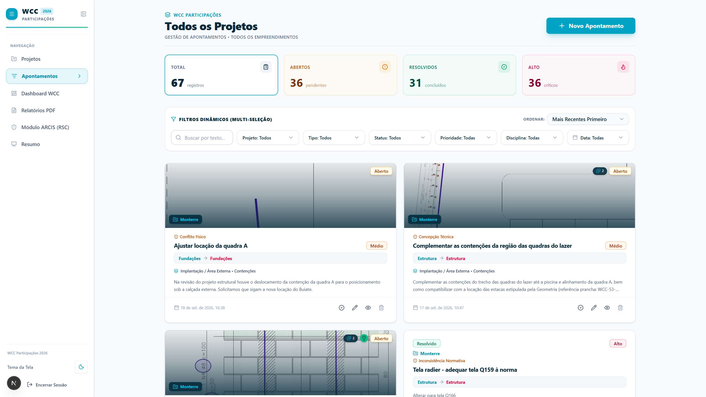
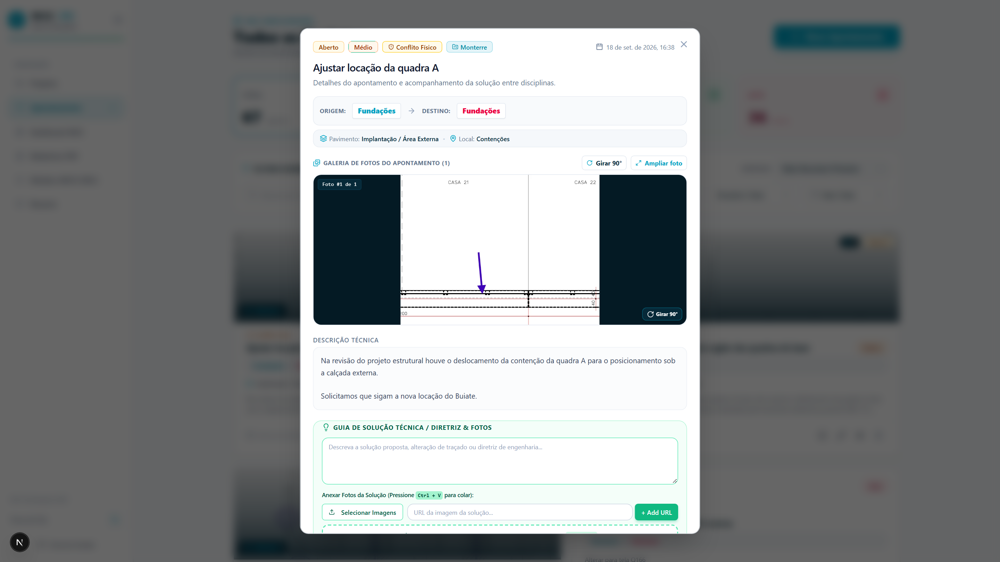
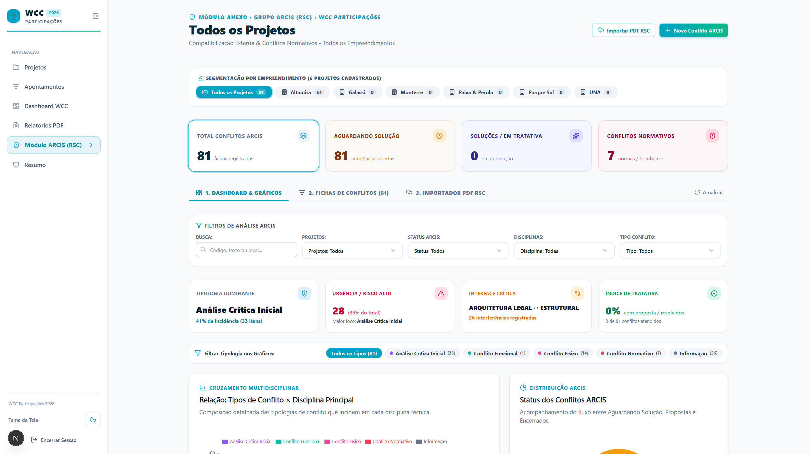
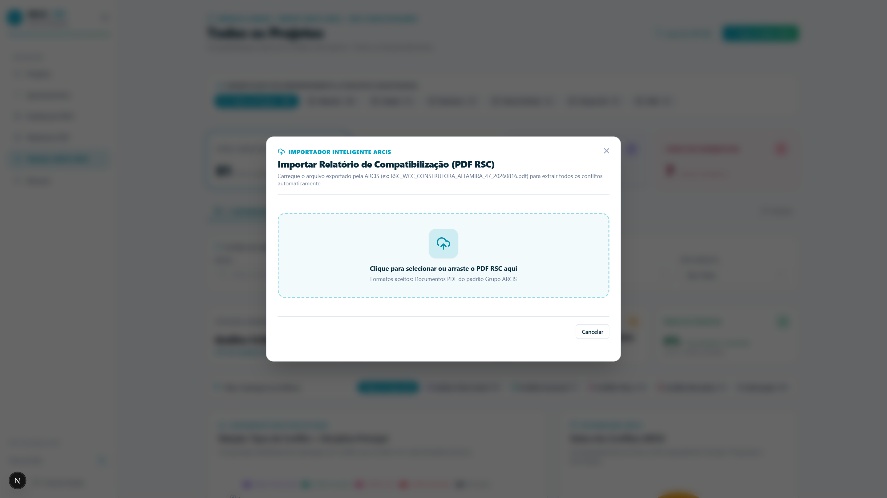
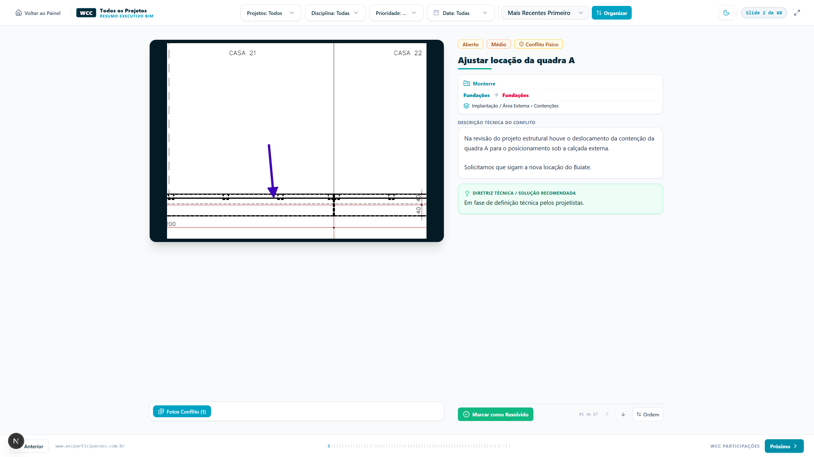
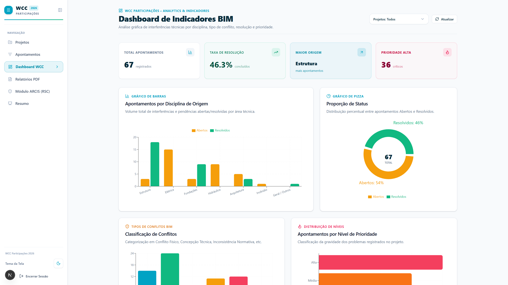
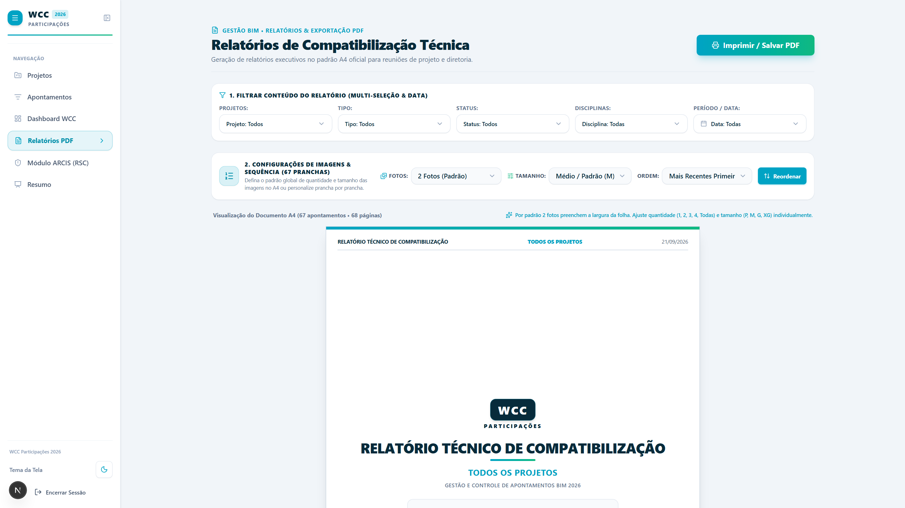

# APÊNDICE A – MANUAL DO USUÁRIO E GUIA PRÁTICO DE OPERAÇÃO DA FERRAMENTA

Este apêndice reúne os procedimentos operacionais de utilização da ferramenta web desenvolvida para a gestão e triagem de apontamentos de compatibilização de projetos. 

O conteúdo reflete o estado atual da ferramenta, que se encontra em **fase de projeto-piloto em um único empreendimento da construtora**, documentando tanto os módulos sob teste prático ativo (triagem de apontamentos, módulo ARCIS e painel de indicadores) quanto aqueles desenvolvidos como propostas funcionais para etapas subsequentes de implantação (modo de apresentação em slides e relatórios A4).

Todas as interfaces e passos descritos foram registrados a partir da execução de rotina de testes ponta a ponta com o framework **Playwright**, atestando o funcionamento das telas no ambiente de testes.

---

## 1. Procedimento 1: Acesso à Plataforma e Triagem Multicritério de Apontamentos (Em Teste Piloto)

Ao carregar o sistema no navegador, o usuário acessa o painel de apontamentos. Esta tela reúne os registros cadastrados para os projetos cadastrados.

  
*Figura A.1 – Interface do Painel Principal com cartões técnicos e filtros multicritério.*  
*Fonte: Captura automatizada via Playwright (2026).*

### Roteiro de Operação:
1. **Seleção de Empreendimento:** No filtro superior `Projeto`, definir o empreendimento objeto da consulta.
2. **Filtragem por Disciplina:** Selecionar a especialidade técnica a ser inspecionada (ex.: *Estrutura*, *Fundações*, *Hidráulica*).
3. **Priorização por Criticidade:** No filtro `Prioridade`, isolar os apontamentos classificados como **Alto** para direcionamento imediato.
4. **Inspeção dos Cartões (*Cards*):** Cada cartão sintetiza a identificação da ocorrência, as disciplinas de origem e destino, o pavimento de referência e a tipologia técnica da inconformidade.

---

## 2. Procedimento 2: Inspeção Detalhada e Registro de Solução Técnica (Em Teste Piloto)

Para consultar o registro fotográfico ou croqui da interferência e formalizar a diretriz técnica definida, o usuário deve acionar o cartão do apontamento.

  
*Figura A.2 – Janela modal exibindo imagem técnica da inconformidade, histórico descritivo e campos de solução.*  
*Fonte: Captura automatizada via Playwright (2026).*

### Roteiro de Operação:
1. **Verificação do Croqui:** Avaliar a prancha ou foto anexada para identificação visual do elemento conflitante.
2. **Leitura da Descrição Técnica:** Conferir o parecer inicial registrado pela compatibilização.
3. **Inserção do Parecer / Solução:** Registrar no campo correspondente a orientação técnica pactuada (ex.: deslocamento de duto, ajuste de traçado de tubulação ou adequação estrutural).
4. **Anexação de Imagens da Resolução:** Inserir o arquivo de evidência da solução aprovada (croqui revisado ou prancha de revisão).
5. **Atualização do Status:** Alterar o seletor de status para **Resolvido** quando a correção for homologada pelos projetistas envolvidos.

---

## 3. Procedimento 3: Ingestão Computacional de Laudos no Padrão ARCIS / RSC (Em Teste Piloto)

O sistema conta com rotina de leitura computacional para processamento direto de relatórios de compatibilização externos emitidos em formato PDF (padrão Grupo ARCIS / RSC).

  
*Figura A.3 – Listagem de conflitos RSC sincronizados com dados e imagens extraídos do documento PDF.*  
*Fonte: Captura automatizada via Playwright (2026).*

  
*Figura A.3b – Janela de diálogo para seleção ou arrasto do arquivo PDF do laudo RSC para extração computacional.*  
*Fonte: Captura automatizada via Playwright (2026).*

### Roteiro de Operação:
1. Acessar o menu lateral e selecionar a opção **Módulo ARCIS (RSC)**.
2. Clicar no botão **Importar PDF RSC** para abrir a janela modal de transferência (Figura A.3b).
3. Arraste ou selecione o arquivo PDF emitido pela empresa de compatibilização.
4. Aguardar o processamento automático:
   * O sistema extrai o código do conflito, disciplinas envolvidas, edificação, pavimento e descrição;
   * As imagens contidas nas páginas do laudo são recortadas, convertidas para formato WebP e armazenadas no serviço em nuvem;
   * Os dados são gravados no banco PostgreSQL por meio de rotina de *upsert*, atualizando apontamentos pré-existentes e inserindo novas ocorrências.
5. Os conflitos passam a constar na tabela de acompanhamento com seus respectivos códigos e status.

---

## 4. Procedimento 4: Apresentação Executiva em Formato de Slides (Proposta Funcional em Validação)

O módulo de apresentação foi desenvolvido como protótipo para permitir a projeção de apontamentos em reuniões técnicas diretamente pelo navegador, servindo como alternativa futura à elaboração manual de apresentações em PowerPoint. **Ressalta-se que este módulo ainda não é utilizado na rotina semanal das reuniões de coordenação da empresa**, constituindo uma proposta de evolução funcional.

  
*Figura A.4 – Interface de projeção em modo slide com visualização da interferência e diretrizes técnicas.*  
*Fonte: Captura automatizada via Playwright (2026).*

### Roteiro de Operação Previsto:
1. No menu lateral, acionar a opção **Resumo / Apresentação**.
2. Ativar o modo de tela cheia por meio do ícone correspondente.
3. **Ajuste da Pauta (Botão "Organizar"):** Reordenar a lista de apontamentos conforme a disponibilidade dos projetistas presentes no encontro.
4. **Navegação de Slides:**
   * Utilizar as teclas direcionais ($\leftarrow$ e $\rightarrow$) ou os comandos na tela para alternar entre as ocorrências;
   * Alternar a visualização entre a foto da interferência e a foto da proposta de solução.
5. **Atualização em Reunião:** O status da ocorrência pode ser atualizado para **Resolvido** diretamente na tela durante a deliberação.

---

## 5. Procedimento 5: Consulta a Indicadores Técnicos no Dashboard (Em Teste Piloto)

O módulo analítico consolida dados quantitativos do empreendimento em teste para avaliação gerencial do andamento das compatibilizações.

  
*Figura A.5 – Painel com indicadores globais de resolução e distribuição de apontamentos por disciplina.*  
*Fonte: Captura automatizada via Playwright (2026).*

### Roteiro de Operação:
1. No menu de navegação, clicar em **Dashboard WCC**.
2. **Taxa de Resolução:** Analisar o percentual acumulado de apontamentos solucionados frente ao total de inconsistências registradas.
3. **Distribuição por Disciplina:** Examinar o gráfico de barras para identificar as disciplinas com maior volume de pendências em aberto.
4. **Avaliação de Criticidade:** Monitorar o total de apontamentos de prioridade alta para priorização de tratativas.

---

## 6. Procedimento 6: Configuração e Exportação de Relatórios Técnicos A4 (Em Teste de Leiaute)

O módulo de relatórios permite a emissão de documentos técnicos padronizados para arquivo de obra ou envio formal a terceiros.

  
*Figura A.6 – Pré-visualização de relatório técnico em folha A4 com controles de diagramação.*  
*Fonte: Captura automatizada via Playwright (2026).*

### Roteiro de Operação:
1. Acessar a guia **Relatórios PDF** no menu lateral.
2. **Definição de Filtros:** Aplicar filtros por pavimento, disciplina ou status conforme a finalidade do relatório.
3. **Ajustes de Diagramação:** Selecionar o número de imagens por ocorrência e o tamanho do quadro de imagem (`P`, `M`, `G` ou `XG`) de modo a acomodar textos longos sem quebras indevidas.
4. **Impressão / Gravação em PDF:** Acionar o comando **Imprimir / Salvar PDF** para acionar a rotina nativa de impressão do navegador e gerar o arquivo PDF formatado.

---

## 7. Procedimento 7: Execução da Rotina de Testes e Captura Automatizada

Para repetição dos testes de interface ou atualização das imagens do manual em caso de alteração no leiaute, a rotina Playwright pode ser executada por meio dos comandos:

```bash
# Inicialização da aplicação em ambiente local com dados de teste
npm run dev:mock

# Execução do script automatizado de navegação e captura de tela
node scripts/capturar_telas_relatorio.mjs
```

A rotina inicializa o navegador Chromium em resolução de $1920 \times 1080$, percorre os fluxos mapeados e atualiza as imagens na pasta `figuras_relatorio/`.
