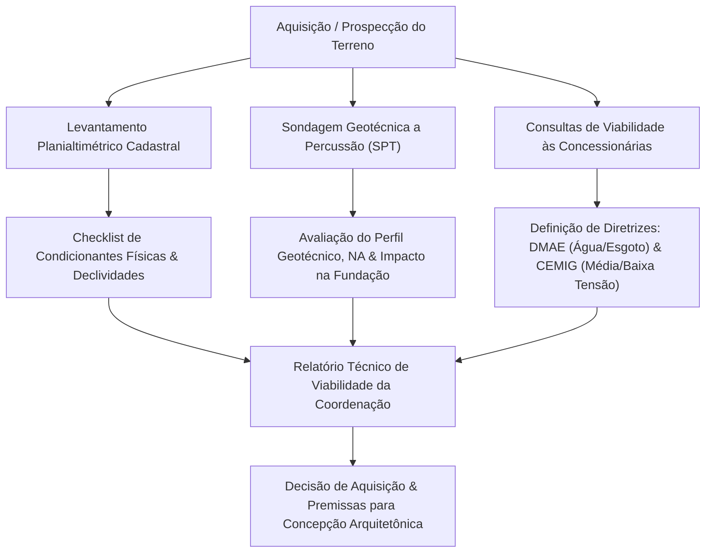

# 2. ROTINAS DE TRABALHO E PROCESSOS DE COORDENAÇÃO TÉCNICA

As atividades desenvolvidas durante o período de estágio foram estruturadas em quatro eixos fundamentais de atuação, cobrindo o fluxo integrado de projeto proposto por Manso e Mitidieri Filho (2007): desde a avaliação preliminar de viabilidade e novos negócios até a assistência técnica aos canteiros de obra. Essa compartimentação permitiu a aplicação de métodos de gestão da informação, controle de qualidade e engenharia diagnóstica, reduzindo riscos técnicos e financeiros para a construtora.

---

## 2.1 Eixo 1: Viabilidade Técnica, Geotécnica e Novos Negócios

A etapa de novos negócios constitui o momento de maior vulnerabilidade econômica e decisória de um empreendimento imobiliário, pois é nela que as premissas de produto são consolidadas frente à escassez de dados preliminares (ASSUMPÇÃO, 1996; FONTENELLE, 2002). Conforme preconizam Manso e Mitidieri Filho (2007), a atuação preventiva da coordenação de projetos na fase de análise de terrenos mitiga riscos construtivos graves e subsidia a incorporação com parâmetros realistas de custo e prazo.

*Figura 2.1 – Fluxo de análise técnica e geotécnica preliminar de terrenos.*  
*Fonte: Elaborado pelo autor com base nas rotinas de estágio e em Manso e Mitidieri Filho (2007).*

### 2.1.1 Aplicação de Checklists e Conferência Planialtimétrica
Para padronizar a investigação de novas áreas, utilizou-se um *Checklist de Análise de Terrenos*, concebido nos moldes do roteiro de análise proposto por Manso e Mitidieri Filho (2007). O procedimento envolvia:
* **Confrontação entre Levantamento Planialtimétrico e Matrícula Imobiliária:** Conferência das dimensões perimetrais reais confrontadas com a certidão de registro de imóveis, identificando discrepâncias de divisas, faixas *non aedificandi*, áreas de servidão e interferências com edificações lindeiras.
* **Topografia e Movimentação de Terra:** Avaliação das cotas de nível natural para cálculo estimativo de corte, aterro e necessidade de estruturas de contenção (muros de arrimo e cortinas atirantadas), variáveis de impacto direto no custo de infraestrutura.
* **Aspectos Ambientais e Urbanísticos:** Verificação de espécies arbóreas protegidas que demandam compensação ambiental ou relocação de blocos na implantação preliminar.

### 2.1.2 Avaliação de Relatórios de Sondagem Geotécnica (SPT)
A interpretação dos laudos de Sondagem de Simples Reconhecimento com SPT (NBR 6484) foi conduzida com foco na antecipação de custos de fundação e contenções:
* **Mapeamento do Perfil Estratigráfico do Solo:** Identificação de camadas superficiais de solo mole (argilas orgânicas ou aterros não compactados com $N_{SPT} < 4$), as quais inviabilizam sapatas isoladas ou radiers diretos sem melhoramento do terreno.
* **Nível do Lençol Freático (NA):** Verificação de água aflorada em cotas coincidentes com os pavimentos de subsolo projetados. A presença de lençol freático exige a previsão de rebaixamento temporário durante as escavações, sistemas de drenagem profunda contínua e impermeabilização rígida por cristalização (mitigando riscos de empuxo hidrostático e infiltrações na contenção).
* **Definição das Tipologias de Fundação:** Apoio técnico na avaliação comparativa de custos entre fundações rasas e profundas (estacas escavadas, hélice contínua ou perfis cravados), correlacionando o comprimento médio de fuste necessário até o impenetrável à percussão com o orçamento previsto.

### 2.1.3 Gestão de Viabilidade em Concessionárias de Serviços Públicos
O enquadramento prévio das demandas das concessionárias de infraestrutura evita paralisações no processo de licenciamento legal e sobrecustos imprevistos de obras civis:
* **Concessionária de Água e Esgoto (DMAE):** Consulta formal quanto à vazão e pressão estática disponível na rede pública de distribuição de água potável para alimentação dos reservatórios inferiores. No subsistema de esgotamento sanitário, avaliou-se a cota da rede coletora pública em relação ao nível do subsolo da edificação: quando o nível das prumadas é inferior à geratriz superior do coletor da rua, exige-se a previsão em projeto de poço de sucção e estação elevatória de esgoto com bombas trituradoras submersas e gerador de emergência. Além disso, gerenciaram-se as demandas de contrapartidas técnicas municipais para reforço de redes públicas.
* **Concessionária de Energia Elétrica (CEMIG):** Análise da demanda de potência instalada do edifício para enquadramento tarifário. Em empreendimentos de médio a grande porte, a carga total ultrapassa o limite normativo para fornecimento em Baixa Tensão, demandando a inclusão mandatória, logo na concepção da arquitetura, de área reservada para **Subestação Abrigada / Cabine Primária (Média Tensão)**, com atendimento a afastamentos de segurança, rota de ventilação natural e acesso para caminhão de manutenção.

---

## 2.2 Eixo 2: Padronização de Processos, Contratação e Gestão da Informação

O aumento da complexidade dos edifícios exige instrumentos contratuais claros e ambientes colaborativos que regulem o fluxo de entrega dos escritórios terceirizados (FRESNEDA, 2004; MELHADO et al., 2004).

### 2.2.1 Elaboração de Cartas-Convite e Escopos Contratuais em BIM
Para a contratação dos serviços de projetos (Arquitetura, Cálculo Estrutural, Elétrica, Hidráulica, Climatização, Prevenção Contra Incêndio e Fundações), elaboraram-se termos de referência com especificação técnica detalhada das entregas:
* **Adoção Mandatória da Metodologia BIM:** Exigência contratual de desenvolvimento dos modelos em ambiente tridimensional paramétrico, com definição dos níveis de desenvolvimento geométrico e de informação (LOD 300 para projetos executivos).
* **Critérios de Entrega por Etapas Formais:** Adoção das fases sugeridas por Melhado et al. (2004) e Manso e Mitidieri Filho (2007): Fase A (Concepção/Estudo Preliminar), Fase B (Definição/Anteprojeto), Fase C (Interfaces/Pré-Executivo) e Fase D (Detalhamento/Executivo). Cada fase condiciona a liberação das etapas seguintes à aprovação das interfaces interdisciplinares.
* **Compatibilização Ativa pelos Projetistas:** Cláusula contratual estabelecendo a corresponsabilidade dos projetistas complementares na checagem dos modelos de arquitetura e estrutura antes da emissão de qualquer revisão.

### 2.2.2 Padronização de Instrumentos Internos de Engenharia
Com o objetivo de evitar distorções entre as promessas de venda e a realidade construtiva, foram estruturados e aplicados formulários corporativos padronizados:
* **Fichas Técnicas de Produto (FTP):** Documento síntese que congela as diretrizes aprovadas (número de dormitórios, áreas privativas, pontos de climatização, padrões de acabamento e louças sanitárias), servindo de alinhamento irrestrito entre Engenharia, Marketing e Comercial.
* **Quadro de Definição de Vagas de Garagem:** Planilha paramétrica para controle quantitativo de vagas (presilhas, soltas, PCD, motos e armários privativos no subsolo), garantindo que as larguras úteis, raios de giro e alturas livres obedeçam estritamente ao Código de Obras local e à legislação urbanística.
* **Relatórios de Análise Técnica (RAT):** Formulários preenchidos pela coordenação ao término de cada fase de projeto para registrar não conformidades gráficas, omissões de cotas e desvios das diretrizes contratuais.

### 2.2.3 Implementação de Rotinas em Ambiente Comum de Dados (CDE)
A gestão da informação eletrônica baseou-se na estruturação de um Ambiente Comum de Dados (*Common Data Environment* - CDE), integrando plataformas em nuvem (InMeta, OneDrive e Servidor Local):
* **Padronização de Codificação e Carimbos:** Instituição de código alfanumérico uniforme para cada prancha:
  $$\text{[EMPREENDIMENTO]}-\text{[FASE]}-\text{[DISCIPLINA]}-\text{[PAVIMENTO]}-\text{[Nº PRANCHA]}-\text{R[REVISÃO]}$$
* **Fluxo de Aprovação e Carimbo "Válido para Obra":** Bloqueio de acesso às versões de estudo ou preliminares nos computadores e tablets do canteiro. Apenas arquivos com parecer formal da coordenação e carimbo digital "VÁLIDO PARA OBRA" eram publicados na pasta mestre de produção, evitando a execução inadvertida de pranchas obsoletas.
* **Rastreabilidade e Histórico de Revisões:** Manutenção de registros detalhados das alterações efetuadas em cada revisão (nuvens de revisão e notas de alteração no carimbo), salvaguardando a responsabilidade técnica e contratual.

### 2.2.4 Acompanhamento Financeiro e Administrativo de Contratos
A coordenação técnica exerceu controle contínuo dos marcos físico-financeiros de projeto:
* **Medições no ERP Sienge:** Cada contrato de projeto foi cadastrado no módulo de contratos do Sienge, com cronograma de desembolso atrelado à entrega das etapas homologadas. As medições financeiras eram liberadas para pagamento somente após a conferência e validação técnica dos arquivos entregues.
* **Gestão de ARTs e RRTs:** Conferência prévia das Anotações e Registros de Responsabilidade Técnica de cada projetista antes do início de qualquer serviço em campo, com verificação do recolhimento de taxas e escopos contratados.
* **Gestão de Aditivos e Distratos:** Análise técnica de pedidos de aditivos de escopo formulados por projetistas terceirizados, diferenciando alterações decorrentes de solicitações do cliente/incorporador daquelas decorrentes de correções de projetos com erros preexistentes.

---

## 2.3 Eixo 3: Engenharia Legal, Desempenho e Aprovações Institucionais

As restrições do plano diretor municipal e as normas técnicas obrigatórias exercem influência direta na volumetria da edificação e nos parâmetros de aproveitamento do terreno.

### 2.3.1 Gestão de Processos de Aprovação Municipal (PMU)
Durante o estágio, atuou-se ativamente na instrução processual de projetos de arquitetura junto à Prefeitura Municipal:
* **Atendimento a Comunique-ses:** Análise dos pareceres técnicos emitidos pelos analistas da Secretaria de Planejamento Urbano e formulação de respostas técnicas fundamentadas, efetuando os ajustes geométricos demandados nos memoriais e pranchas sem descaracterizar a viabilidade comercial do projeto.
* **Equacionamento dos Índices Urbanísticos:** Cálculo e conferência do Coeficiente de Aproveitamento (básico e máximo via outorga onerosa do direito de construir), Taxa de Ocupação, Taxa de Permeabilidade e recuos obrigatórios frontais, laterais e de fundos.
* **Ajuste de Geometria de Garagens:** Dimensionamento das rampas de acesso aos subsolos (inclinações máximas de 20% com trechos de transição horizontal de 10% nas extremidades para evitar raspagem de veículos), larguras de faixas de circulação e demarcação de vagas com obediência aos gabaritos municipais.

### 2.3.2 Atendimento às Exigências do Corpo de Bombeiros Militar
O projeto de segurança contra incêndio e pânico (instruções técnicas do CBMMG) dita requisitos arquitetônicos e estruturais de alta complexidade:
* **Dimensionamento de Rotas de Fuga e Escadas Enclausuradas:** Verificação das distâncias máximas a percorrer até a saída segura, cálculo do número de unidades de passagem (UP) e dimensionamento de portas corta-fogo (P90 e P120) com barras antipânico.
* **Sistemas de Pressurização de Escadas de Emergência:** Definição arquitetônica e estrutural das salas de pressurização no pavimento térreo ou ático, dimensionando os dutos verticais de insuflamento de ar e assegurando a captação de ar limpo distante de grelhas de ventilação de esgoto ou descargas de gases de geradores.
* **Compartimentação Corta-Fogo em Átrios e Shafts:** Especificação de fechamentos estanques à fumaça e selagens corta-fogo em passagens de tubulações entre pavimentos distintos.

### 2.3.3 Adequação à NBR 15575 (Norma de Desempenho de Edificações)
A coordenação assegurou que as premissas de projeto atendessem aos níveis mínimos (ou intermediários) da NBR 15575:
* **Desempenho Acústico (Partes 3 e 4):** Exigência de mantas acústicas sob o contrapiso em áreas privativas sobrepostas para atendimento aos índices de ruído de impacto ($L'_{nT,w} \leq 55\text{ dB}$), bem como escolha de alvenarias de vedação com massa superficial adequada entre unidades autônomas distintas ($D_{nT,w} \geq 45\text{ dB}$).
* **Desempenho Térmico e Lumínico:** Verificação das taxas mínimas de ventilação e iluminação natural em dormitórios e salas, checando o fator solar dos vidros especificados e o cálculo térmico das envoltórias de fachada.
* **Vida Útil de Projeto (VUP):** Compatibilização das espessuras de cobrimento de armadura na estrutura de concreto armado (NBR 6118) de acordo com a classe de agressividade ambiental do terreno, garantindo VUP mínima de 50 anos para a estrutura principal.

---

## 2.4 Eixo 4: Compatibilização Multidisciplinar e Interface Obra-Projeto

A compatibilização interdisciplinar tem como meta primordial eliminar conflitos geométricos e operacionais entre subsistemas antes que a armação de formas ou lançamento de concreto ocorra no canteiro de obras.

### 2.4.1 Resolução de Interferências Hidrossanitárias, Estruturais e de Climatização
Dentre as inconformidades mais recorrentes nas análises técnicas, destacaram-se:
* **Geometria de Reservatórios de Água e Barriletes:** Dimensionamento de reservatórios superiores e inferiores, mitigando o risco de sucção negativa e cavitação nas bombas de recalque. No ático, a altura técnica do barrilete foi rigorosamente conferida para viabilizar a perda de carga hidráulica necessária nos pontos de consumo dos pavimentos superiores sem exigir pressurizadores mecânicos contínuos.
* **Passagem de Tubulações por Elementos Estruturais:** Conflito clássico entre ramais de esgoto com caimento gravitacional (1% a 2%) e vigas de concreto armado de grande altura. A coordenação intermediou a alocação de furos técnicos horizontais previstos em cálculo estrutural (respeitando a zona de tração/cisalhamento da viga) ou o rebaixamento de forros de gesso para desvio dos tubos, evitando perfurações predatórias na fase de obra.
* **Dimensionamento e Continuidade de Shafts:** Conferência da prumada vertical dos shafts técnicos ao longo de toda a edificação. Corrigiram-se estrangulamentos espaciais onde prumadas hidráulicas, eletrocalhas e dutos de exaustão mecânica disputavam o mesmo espaço confinado.

### 2.4.2 Confrontação de Formas Estruturais com o Layout Arquitetônico
A sobreposição de plantas de formas estruturais com as pranchas de arquitetura permitiu correções antecipadas essenciais:
* **Rotação e Reposicionamento de Pilares no Subsolo:** Ajuste de dimensões e giro de seções de pilares de sustentação da torre que, na concepção original do calculista, invadiam gabaritos de vagas de garagem ou estrangulavam pistas de manobra de veículos.
* **Vigas de Transição sobre Áreas Sociais:** Verificação dos pavimentos de transição (geralmente acima do térreo ou mezanino), conferindo se a altura de vigas protendidas ou invertidas não gerava pé-direito livre inferior ao mínimo normativo de 2,40 m em halls, salões de festas ou acessos de pedestres.

### 2.4.3 Suporte Técnico Contínuo aos Canteiros de Obra e Lições Aprendidas
Em consonância com Manso e Mitidieri Filho (2007), a gestão de projetos não cessa na entrega das pranchas, mas estende-se durante todo o ciclo construtivo:
* **Atendimento a Solicitações de Informação (RFI):** Recebimento e triagem de dúvidas dos engenheiros de obra quanto a detalhamentos não explícitos nas pranchas, intermediando a consulta formal ao projetista autor e despachando a resposta homologada no CDE.
* **Registro de Lições Aprendidas:** Catalogação das dificuldades de construtibilidade reportadas pela produção em formulários internos. Esse acervo serviu de insumo técnico de retroalimentação (*feedback loop*) para a elaboração dos escopos dos novos empreendimentos lançados pela construtora, impedindo a reincidência de erros técnicos conhecidos.
