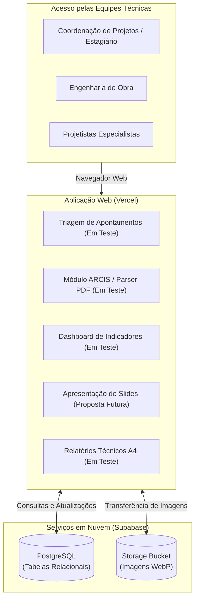

# CAPÍTULO 3: DESENVOLVIMENTO DA FERRAMENTA DE GESTÃO DE APONTAMENTOS

## 3.1 Concepção e Levantamento de Requisitos da Solução

O processo de coordenação e compatibilização de projetos em edificações envolve a integração contínua de múltiplos subsistemas técnicos: arquitetura, estrutura de concreto/metálica, fundações, instalações hidrossanitárias, elétricas, climatização (HVAC) e sistemas de proteção contra incêndio. Durante o acompanhamento das atividades técnicas do estágio, verificou-se que a identificação de interferências físicas (*hard clashes*) e incoerências normativas ou técnicas gerava relatórios periódicos, predominantemente formalizados em arquivos estáticos no formato PDF — a exemplo dos Relatórios de Solução de Conflitos (RSC).

A gestão desses laudos no fluxo de trabalho tradicional apresentava pontos de atenção operacional:
1. **Dificuldade de indexação e busca:** Arquivos PDF extensos não permitem filtragem simultânea e dinâmica por múltiplos parâmetros (como pavimento, disciplina e severidade), demandando conferência visual repetitiva prancha a prancha.
2. **Tempo despendido na compilação de dados:** A preparação de reuniões de alinhamento com projetistas frequentemente exigia a transferência manual de trechos de texto e capturas de tela das pranchas para apresentações em PowerPoint.
3. **Fragmentação do histórico de deliberações:** As decisões técnicas tomadas ao longo das revisões ficavam dispersas entre atas de reunião, memoriais e correios eletrônicos, dificultando a rastreabilidade do encerramento de cada ocorrência.

Com base nesse diagnóstico, delimitou-se a proposta de estruturar uma ferramenta em ambiente web voltada à centralização das informações de compatibilização. Os requisitos funcionais estabelecidos contemplaram:
* Cadastro padronizado de empreendimentos e pavimentos da edificação;
* Registro de ocorrências com vinculação de disciplina de origem, disciplina de destino, tipologia técnica e registros fotográficos da interferência e da solução;
* Leitura computacional de arquivos de compatibilização externos no padrão ARCIS (RSC);
* Consolidação de métricas em painel gráfico (dashboard) para acompanhamento da taxa de resolução;
* Módulo de projeção em tela cheia voltado à condução de reuniões (desenvolvido como protótipo funcional para etapas subsequentes);
* Emissão de relatórios técnicos com diagramação em formato A4.

---

## 3.2 Abordagem de Desenvolvimento e Estrutura Tecnológica

Para viabilizar a estruturação do sistema dentro do cronograma do estágio, priorizou-se uma arquitetura baseada em serviços gerenciados em nuvem e apoio de ferramentas de automação.

### 3.2.1 Metodologia de Desenvolvimento Assistida por Inteligência Artificial
A codificação da aplicação contou com o suporte de ferramentas de Inteligência Artificial generativa aplicadas à geração de código-fonte. Esse suporte foi direcionado à estruturação de componentes de interface, estilização e implementação de funções utilitárias.

Nessa abordagem, a atuação do estagiário concentrou-se no **levantamento de requisitos, na definição das regras de negócio de engenharia, na modelagem dos dados de compatibilização e nos testes práticos com projetos reais da empresa**. A IA operou como ferramenta de produtividade para transcrição das diretrizes técnicas em código executável.

### 3.2.2 Infraestrutura e Persistência de Dados em Nuvem
A aplicação foi estruturada sem dependência de servidores físicos locais ou instalações individuais nas estações de trabalho:

* **Banco de Dados Relacional e Armazenamento (Supabase):** A modelagem de dados foi implementada sobre o banco relacional PostgreSQL, hospedado na plataforma Supabase. Foram aplicadas políticas de controle de acesso em nível de linha (*Row Level Security* - RLS). Para a guarda de arquivos gráficos (croquis, pranchas e fotos de obra), utilizou-se o armazenamento de objetos (*storage buckets*) da mesma plataforma, com compressão prévia das imagens no formato WebP.
* **Hospedagem da Aplicação Web (Vercel):** O sistema foi disponibilizado por meio da infraestrutura da Vercel, permitindo acesso universal via navegadores convencionais, tanto no ambiente corporativo quanto no canteiro de obras.

---

## 3.3 Modelagem dos Dados Técnicos de Compatibilização

A estrutura de dados foi organizada para refletir os parâmetros adotados na rotina de engenharia diagnóstica e coordenação de projetos:

1. **Estrutura Espacial do Edifício:** Os dados são indexados pelo empreendimento correspondente e associados a pavimentos predefinidos (Subsolos, Térreo, Pavimentos Tipo, Cobertura, Ático, etc.), padronizando a nomenclatura entre as diferentes disciplinas.
2. **Classificação Multidisciplinar:** O sistema registra a disciplina geradora da inconformidade e a disciplina impactada (Arquitetura, Estrutura, Instalações Elétricas, Hidráulica, Climatização, Prevenção Contra Incêndio e Fundações).
3. **Tipologias de Inconsistência:**
   * *Conflito Físico:* Intersecção geométrica direta entre elementos construtivos.
   * *Concepção Técnica:* Divergências de dimensionamento ou traçado entre projetos complementares.
   * *Inconsistência Normativa:* Desconformidade com normas técnicas da ABNT ou diretrizes do Corpo de Bombeiros.
   * *Definição de Produto:* Demandas pendentes de definição comercial ou de acabamento pelo cliente/incorporador.
   * *Informação:* Falta de cotas, notas explicativas ou detalhamentos em prancha.
4. **Criticidade e Tramitação:** Atribuição de níveis de severidade (Baixa, Média e Alta) e controle de status do apontamento (Aberto, Em Análise e Resolvido).

---

## 3.4 Contexto de Aplicação: Projeto-Piloto em Andamento

É relevante registrar que a ferramenta encontra-se em **fase de projeto-piloto e implantação gradual na construtora**. O sistema não está disseminado para a totalidade dos empreendimentos da empresa; sua utilização está delimitada a um projeto específico para validação prática dos fluxos e verificação da aderência técnica da solução.

Nesse estágio de teste, os módulos da ferramenta possuem diferentes níveis de maturidade e aplicação na rotina:
* **Módulos em teste ativo na rotina:** Cadastro e triagem de apontamentos internos, módulo de leitura/importação de relatórios de compatibilização no padrão ARCIS (RSC) e acompanhamento métrico por meio do dashboard de indicadores.
* **Módulos concebidos para fases futuras de implantação:** O módulo de Apresentação Executiva em formato de slides foi implementado na estrutura do sistema, mas **ainda não é adotado de forma rotineira nas reuniões de coordenação com projetistas**. Sua inclusão no desenvolvimento visou demonstrar a viabilidade técnica da transição do PowerPoint manual para uma solução integrada, constituindo uma proposta de evolução para as próximas etapas de maturação do processo na empresa.

---

## 3.5 Módulos do Sistema e Resultados dos Testes Operacionais

A seguir são descritos os componentes da ferramenta com base nas telas capturadas durante os testes operacionais do projeto-piloto.

### 3.5.1 Módulo de Gestão e Triagem de Apontamentos (Em Uso Piloto)
O painel de apontamentos permite a visualização consolidada dos registros por meio de cartões informativos (*cards*). Cada cartão exibe o título da ocorrência, disciplinas envolvidas, pavimento, localização, nível de prioridade e selo de status.

A barra superior reúne filtros simultâneos por projeto, tipologia, status, prioridade, disciplina e intervalo de datas, viabilizando buscas direcionadas para o alinhamento técnico.

  
*Figura 3.1 – Painel principal com filtragem multicritério e visão geral dos apontamentos por empreendimento.*  
*Fonte: Dados da pesquisa capturados via automação Playwright (2026).*

Ao selecionar um cartão, uma janela modal detalha o histórico do apontamento, permitindo examinar o croqui da interferência em alta resolução, registrar a diretriz técnica definida e alterar o status para resolvido após validação.

  
*Figura 3.1b – Modal de inspeção técnica contendo imagem da interferência em planta e campos para inserção da diretriz adotada.*  
*Fonte: Dados da pesquisa capturados via automação Playwright (2026).*

### 3.5.2 Módulo ARCIS / Ingestão de Relatórios de Compatibilização (Em Uso Piloto)
Este módulo foi desenvolvido para testar a integração computacional com laudos de compatibilização externos (padrão Grupo ARCIS / RSC), frequentemente recebidos em arquivos PDF com dezenas de páginas.

O procedimento baseia-se na extração automatizada de dados:
1. O operador anexa o arquivo PDF do relatório na interface web.
2. Uma rotina de leitura computacional (*parser*) processa o conteúdo, identificando o código do conflito, disciplinas envolvidas, localização, pavimento e parecer técnico.
3. As imagens das plantas e interferências contidas no documento são extraídas, convertidas para o padrão WebP e enviadas ao serviço de armazenamento em nuvem.
4. Os dados são sincronizados no banco PostgreSQL por meio de operação de atualização/inserção (*upsert*), evitando duplicidades.

Esse teste demonstrou a viabilidade de eliminar a transcrição manual de laudos, reduzindo o tempo de entrada dos dados de horas para poucos minutos de processamento digital.

  
*Figura 3.2 – Módulo de controle de conflitos do laudo RSC (Grupo ARCIS) com dados e imagens extraídos de PDF.*  
*Fonte: Dados da pesquisa capturados via automação Playwright (2026).*

### 3.5.3 Módulo de Apresentação Executiva em Slides (Proposta Funcional em Validação)
O módulo de apresentação foi concebido para endereçar a demanda de projeção de apontamentos em reuniões de projeto, servindo de alternativa à confecção periódica de apresentações em PowerPoint.

A interface apresenta o apontamento em modo de tela cheia, com tipografia legível para projeção ou compartilhamento de tela, disponibilizando:
* Alternância entre as fotos da interferência e as fotos da solução aprovada;
* Reordenação da sequência dos apontamentos para ajuste à pauta dos participantes presentes;
* Atualização direta do status da pendência durante a conferência.

Conforme registrado na contextualização, **este módulo ainda não é utilizado na rotina semanal das reuniões de coordenação da empresa**, permanecendo como recurso funcional prototipado e validado tecnicamente para adoção futura após a consolidação do projeto-piloto.

  
*Figura 3.3 – Modo de apresentação interativo com visualização da interferência e diretriz técnica em formato de slide.*  
*Fonte: Dados da pesquisa capturados via automação Playwright (2026).*

### 3.5.4 Painel Analítico e Dashboards de Indicadores (Em Uso Piloto)
O painel de indicadores consolida métricas quantitativas do projeto em teste para subsidiar a tomada de decisão da engenharia:
* **Taxa de Resolução Global:** Relação percentual entre apontamentos solucionados e total identificado.
* **Volume por Disciplina de Origem:** Gráficos que evidenciam os subsistemas com maior concentração de inconsistências, permitindo direcionar esforços de revisão aos projetistas envolvidos.
* **Distribuição por Gravidade e Tipologia:** Mapeamento do percentual de interferências de prioridade alta versus média/baixa, orientando a ordem de tratamento técnico.

  
*Figura 3.4 – Dashboard com indicadores de taxa de resolução e distribuição de apontamentos por disciplina.*  
*Fonte: Dados da pesquisa capturados via automação Playwright (2026).*

### 3.5.5 Módulo de Emissão de Relatórios Técnicos em Formato A4 (Em Teste de Homologação)
O módulo de relatórios visa atender à formalização de pendências junto a projetistas ou arquivamento técnico de obra:
* Possibilita aplicar filtros prévios para geração de laudos temáticos (ex.: apenas ocorrências estruturais de determinado pavimento);
* Realiza o cálculo dinâmico de layout para assegurar que textos descritivos e imagens fiquem contidos em folhas de formato A4 sem sobreposições;
* Permite a exportação direta para PDF utilizando as funções nativas de impressão do navegador.

  
*Figura 3.5 – Pré-visualização de relatório técnico estruturado com cabeçalho padrão e paginação A4.*  
*Fonte: Dados da pesquisa capturados via automação Playwright (2026).*

---

## 3.6 Quadro Comparativo dos Fluxos e Avaliação Preliminar

A aplicação experimental da ferramenta no empreendimento-piloto permitiu avaliar comparativamente o método convencional em relação à sistemática proposta, conforme sistematizado no Quadro 3.1.

**Quadro 3.1 – Comparativo entre o fluxo convencional e o fluxo testado no projeto-piloto**

| Etapa Técnica | Método Convencional | Sistemática Testada / Proposta na Ferramenta | Status de Adoção no Estágio |
| :--- | :--- | :--- | :--- |
| **Entrada de Laudos (RSC)** | Leitura manual de PDFs extensos, digitação de textos e recorte individual de fotos. | Importação automatizada via parser computacional com envio das imagens ao banco em nuvem. | **Em teste ativo no projeto-piloto** |
| **Consulta de Apontamentos** | Busca sequencial em documentos em PDF ou planilhas desconectadas. | Filtragem multicritério instantânea por pavimento, disciplina e criticidade. | **Em teste ativo no projeto-piloto** |
| **Monitoramento de Metas** | Tabulação manual esporádica para levantamento de totais de pendências. | Dashboards dinâmicos com gráficos de taxa de resolução e volume por disciplina. | **Em teste ativo no projeto-piloto** |
| **Condução de Reuniões** | Elaboração prévia de apresentações em PowerPoint com recortes de pranchas. | Modo Apresentação em tela cheia com navegação de slides e reordenação de pauta. | **Proposta funcional (não adotada na rotina atual)** |
| **Formalização em Relatório** | Edição manual de documentos no Word ou PowerPoint para envio por e-mail. | Geração padronizada em folha A4 com diagramação automática para PDF. | **Em fase de validação de leiaute** |

*Fonte: Elaborado pelo autor (2026).*

Os resultados obtidos no projeto-piloto indicam que a centralização dos dados e a automatização da leitura de laudos reduzem tarefas repetitivas de digitação e triagem, criando condições para que a equipe técnica priorize a análise de engenharia. A continuidade da implantação nos demais empreendimentos e a incorporação do módulo de apresentação nas reuniões rotineiras constituem os passos seguintes do processo de modernização em andamento na empresa.
