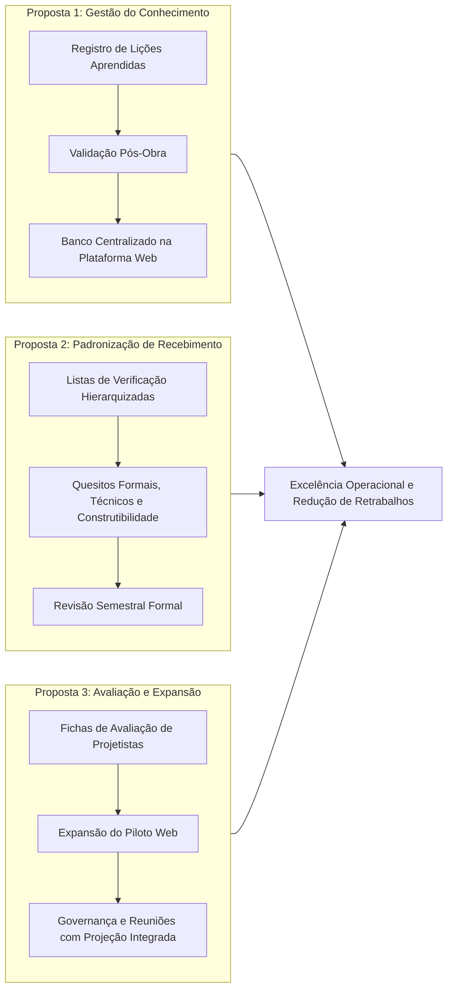

# CAPÍTULO 4: ANÁLISE CRÍTICA E CONSIDERAÇÕES FINAIS

## 4.1 Confrontação entre a Formação Curricular e a Prática Profissional

A experiência vivenciada no setor de engenharia e coordenação de projetos da WCC Participações proporcionou uma oportunidade singular de confrontação entre os modelos teóricos lecionados no ambiente acadêmico e a realidade operacional da construção civil imobiliária. O currículo dos cursos de graduação em Engenharia Civil e Arquitetura e Urbanismo tradicionalmente fundamenta-se na compartimentação do conhecimento em disciplinas analíticas autônomas, estruturadas sob uma perspectiva linear e cartesiana. Todavia, a prática profissional de coordenação exige uma abordagem fundamentalmente holística, dialética e integrativa, em que nenhuma decisão técnica subsiste de maneira isolada.

### 4.1.1 Estruturas de Concreto e Fundações frente à Coordenação Espacial
Nas disciplinas acadêmicas de Estruturas de Concreto Armado, Mecânica das Estruturas e Fundações, a ênfase pedagógica recai prioritariamente sobre o dimensionamento de elementos isolados — vigas, pilares, lajes, sapatas e estacas — submetidos a estados-limite últimos (ELU) e estados-limite de serviço (ELS), conforme os parâmetros da ABNT NBR 6118 (Projeto de Estruturas de Concreto) e ABNT NBR 6122 (Projeto e Execução de Fundações).

Na rotina da coordenação de projetos, contudo, o cálculo numérico é apenas uma das vertentes da viabilidade construtiva. O desafio cotidiano concentra-se nas interfaces físicas e construtivas:
* **Furos e Passagens em Elementos Estruturais:** A universidade aborda a NBR 6118 em termos de tensões tangenciais e cálculo de armaduras de costura adicionais. Na coordenação, o problema reside na conciliação prévia entre os furos em vigas solicitados pelos tubos de queda de esgoto (DN 100/DN 150) e a densidade de armaduras longitudinais e estribos próximos aos apoios, evitando conflitos físicos que na ausência de coordenação resultam em quebras de concreto não autorizadas no canteiro de obras.
* **Transição Estrutural e Garagens:** No subsolo, a rotação de pilares ou a adoção de vigas de transição para assegurar a largura mínima de vagas de estacionamento e faixas de manobra (exigências do Código de Obras municipal) contrasta com a modulação dos pilares nos pavimentos tipo de apartamentos. A análise crítica exigiu avaliar não apenas a segurança estrutural, mas o impacto econômico no consumo de aço e formas, além da altura livre (*pé-direito* livre útil) para passagem de tubulações suspensas e barramentos blindados.
* **Geotecnia e Contenções:** A interpretação de relatórios de sondagem SPT (ABNT NBR 6484), aprendida teoricamente para determinação do índice de resistência à penetração ($N_{SPT}$) e cota de apoio de estacas, desdobrou-se na prática em avaliações geotécnicas complexas: presença de nível freático elevado, empuxos laterais sobre subsolos contíguos a edificações vizinhas e definição do método executivo de contenção (cortinas de perfis com pranchamento versus perfis metálicos encamisados), demandando constante gestão de riscos técnicos.

### 4.1.2 Instalações Prediais, Concessionárias e Construtibilidade
As disciplinas de Instalações Prediais Hidráulicas, Sanitárias e Elétricas comumente priorizam os métodos de dimensionamento de vazões de cálculo, perdas de carga contínuas e localizadas (fórmula de Fair-Whipple-Hsiao e Hazen-Williams) e balanceamento de circuitos elétricos, em concordância com a ABNT NBR 5626 (Sistemas Prediais de Água Fria e Quente), ABNT NBR 8160 (Sistemas Prediais de Esgoto Sanitário) e ABNT NBR 5410 (Instalações Elétricas de Baixa Tensão).

Na rotina de projetos de edifícios verticais de múltiplos pavimentos, os maiores impasses verificados no estágio não decorreram do dimensionamento dos diâmetros nominais, mas do volume espacial requerido pelos subsistemas prediais e pelas exigências normativas das concessionárias locais (DMAE e CEMIG):
* **Topologia de Barriletes e Reservatórios:** Conciliar as cotas de fundo de reservatórios inferiores com as exigências de sucção afogada de bombas de incêndio e consumo, garantindo que o bolsão de ar dos barriletes superiores não interfira nas alturas livres de trânsito em áticos e barriletes técnicos.
* **Shafts e Roteamento de Prumadas:** O dimensionamento de prumadas verticais revelou-se intrinsecamente atrelado à perda de área privativa de arquitetura e à construtibilidade. Em múltiplos casos analisados, tubulações de esgoto e ventilação precisaram de desvios geométricos para evitar a intersecção com vigas de balanço e elementos de fachada, exigindo análise de caimento mínimo (declividades normativas) e acessibilidade para manutenção futura.
* **Interface com Concessionárias:** A complexidade burocrática e normativa das concessionárias de energia (CEMIG) e saneamento (DMAE) evidenciou que a conformidade do projeto depende de requisitos específicos de postos de transformação em alvenaria ou cabines blindadas, faixas de servidão e recuos técnicos obrigatórios, temáticas frequentemente ausentes das matrizes curriculares acadêmicas.

### 4.1.3 Engenharia Legal, Segurança Contra Incêndio e Desempenho (NBR 15575)
A grade universitária tradicional dedica carga horária modesta à Engenharia Legal e às Normas de Desempenho. No entanto, a atuação no setor demonstrou que a conformidade legal constitui o principal balizador de viabilidade dos empreendimentos:
* **Norma de Desempenho (ABNT NBR 15575):** A aplicação das exigências de desempenho térmico, lumínico e acústico (especialmente isolamento de ruído aéreo entre unidades habitacionais contíguas e ruído de impacto em pisos) exigiu a seleção judiciosa de blocos de vedação, argamassas e mantas acústicas, vinculando especificação de projeto ao orçamento de suprimentos.
* **Segurança Contra Incêndio e Pânico (CBMMG):** As instruções técnicas do Corpo de Bombeiros Militar de Minas Gerais impõem rigorosas restrições geométricas a caixas de escada pressurizadas, portas corta-fogo, rotas de fuga, antecâmaras e instalações de hidrantes e chuveiros automáticos (*sprinklers*), exigindo que a coordenação atue de forma preventiva antes do protocolo final no Sistema INFOSCIP.

### 4.1.4 Gestão de Processos e a Visão Sistêmica do Edifício
A constatação crítica mais relevante reside na fragmentação do ensino de engenharia: aprende-se a calcular a estrutura sem considerar a tubulação que a atravessa; projeta-se o layout de arquitetura sem antever a interferência do shaft na armadura de pilares. A coordenação de projetos constitui exatamente o elo integrador desse ecossistema. 

Conforme preconiza Melhado (1994, 2004), o projeto deve ser compreendido como um processo dinâmico de produção de informações, e não apenas como um conjunto de desenhos gráficos entregues ao final de um prazo. O estágio permitiu consolidar a visão do edifício como um sistema integrado de subsistemas interconectados, onde qualquer alteração pontual desencadeia repercussões em cadeia sobre custo, prazo, qualidade e construtibilidade.

---

## 4.2 Competências Desenvolvidas e Desafios Enfrentados

A atuação como estagiário na interface entre os diversos agentes da construção civil impulsionou o desenvolvimento de competências técnicas (*hard skills*) e comportamentais (*soft skills*), além de expor desafios característicos do gerenciamento de equipes multidisciplinares.

### 4.2.1 Domínio Instrumental e Competências Técnicas
No escopo das competências analíticas e instrumentais, destacam-se:
1. **Interpretação e Leitura Crítica Multidisciplinar:** Capacidade de examinar pranchas de diferentes disciplinas em paralelo, confrontando cotas, níveis de piso acabado e osso, seções de elementos estruturais e prumadas hidrossanitárias.
2. **Operação de Ambientes Comuns de Dados (CDE):** Padronização e estruturação documental em plataformas como InMeta, Microsoft OneDrive e integração com o sistema ERP Sienge, estabelecendo rigor de versionamento e rastreabilidade documental.
3. **Parametrização de Dados e Automação:** Estruturação de bancos de dados relacionais (PostgreSQL na Supabase) e elaboração de rotinas automatizadas para tratamento de laudos de compatibilização e extração de indicadores, unindo lógica de computação com necessidades práticas de engenharia.
4. **Análise de Riscos Técnicos e Mitigação Prévia:** Elaboração de pareceres técnicos sobre interferências críticas, ponderando a relação entre a gravidade do conflito físico e o custo de retrabalho caso a pendência atingisse o canteiro de obras.

### 4.2.2 Competências Comportamentais e Desafios de Gestão
A gestão de projetos é intrinsecamente um exercício de relações interpessoais e articulação política entre profissionais com visões e interesses técnicos distintos:
* **Mediação Técnica com Projetistas Seniores:** Um dos desafios mais expressivos consistiu na interlocução com engenheiros calculistas, projetistas de instalações e arquitetos com vasta experiência de mercado. A atuação exigiu maturidade, postura ética, argumentação embasada estritamente em critérios técnicos e normativos e respeito às responsabilidades legais de cada autor de projeto. A coordenação não visa questionar a autoria técnica do especialista, mas apontar interferências geométricas e inconsistências de premissas com clareza e urbanidade.
* **Gestão da Comunicação e Alinhamento de Expectativas:** Mitigar divergências entre o conceito estético concebido pela arquitetura e as restrições impostas pelos projetos complementares de engenharia (como espessura de lajes, rebaixos de forro de gesso e vịgas de transição).
* **Disciplina de Prazos e Condução sob Pressão:** Administrar cronogramas de entrega em fases de lançamento imobiliário, gerenciando a interdependência entre disciplinas (ex.: o projetista estrutural necessita das cargas das alvenarias e locação de shafts para finalizar o dimensionamento das vigas).

---

## 4.3 Propostas de Melhoria para o Setor Técnico da Empresa

A literatura técnica especializada em gestão de projetos na construção civil fornece subsídios consolidados para o aprimoramento dos processos corporativos. O modelo formulado por **Manso e Mitidieri Filho (2007)**, em pesquisa desenvolvida junto a construtoras e incorporadoras, fundamenta-se na premissa de que a coordenação de projetos deve atuar como facilitadora central do processo por meio da **gestão do conhecimento**, da **análise de riscos** e da **melhoria contínua**.

Com base nos diagnósticos levantados ao longo do estágio e na fundamentação de Manso e Mitidieri Filho (2007), apresentam-se três propostas de melhoria estruturadas para o setor de engenharia e projetos da WCC Participações.

### 4.3.1 Proposta 1: Formalização do Sistema de Lições Aprendidas e Retroalimentação (Obra-Projeto)
* **Diagnóstico Atual:** As soluções adotadas no canteiro de obras para contornar interferências imprevistas nem sempre retornam formalmente ao setor de projetos. Esse distanciamento gera a recorrência de problemas congêneres em empreendimentos subsequentes.
* **Diretriz de Manso e Mitidieri Filho (2007):** Os autores destacam que o processo de coordenação não se esgota com a entrega das pranchas executivas; deve estender-se à fase de execução e culminar na validação pós-entrega através de relatórios de *lições aprendidas*, alimentando a base de dados técnica da organização para mitigar a repetição de falhas conhecidas.
* **Ação Proposta:**
  1. Instituir a obrigatoriedade de **reuniões de fechamento de obra e validação técnica** ao término de cada empreendimento, reunindo coordenação de projetos, gerência de obras e projetistas-chave.
  2. Implementar na plataforma web desenvolvida no estágio um **módulo de Lições Aprendidas**, indexando ocorrências por subsistema construtivo (ex.: impermeabilização de lajes de transição, detalhamento de pingadeiras de platibanda, fixação de tubulações sob laje).
  3. Vincular a consulta a esse acervo como etapa prévia obrigatória na emissão das diretrizes de concepção de novos projetos.

### 4.3.2 Proposta 2: Padronização de Listas de Verificação (Checklists) Hierarquizadas
* **Diagnóstico Atual:** A conferência das pranchas recebidas nas diferentes etapas de projeto é realizada com base na expertise individual dos técnicos do setor, sujeitando o processo à sobrecarga cognitiva e eventual omissão de itens críticos.
* **Diretriz de Manso e Mitidieri Filho (2007):** O modelo propõe o emprego de **listas de verificação (*checklists*) hierarquizadas e estruturadas em três níveis sucessivos de análise crítica**:
  1. *Quesitos Formais:* Nomenclatura padronizada de arquivos, carimbos, escalas, notas de revisão e assinaturas de responsabilidade técnica (ART/RRT).
  2. *Informações Técnicas Essenciais:* Cotas de amarração, níveis de piso, indicação precisa de caimentos, especificações técnicas de materiais e conformidade com as normas ABNT aplicáveis.
  3. *Quesitos de Construtibilidade e Conteúdo:* Integração plena com os subsistemas vizinhos, facilidade de montagem de formas e armações, acesso a registros e caixas sifonadas para inspeção e conformidade estrita com o padrão de acabamento da construtora.
* **Ação Proposta:**
  1. Estruturar formalmente os *checklists* nos três níveis propostos por Manso e Mitidieri Filho (2007), disponibilizando-os aos projetistas terceirizados previamente à elaboração dos projetos.
  2. Estabelecer a rotina de **revisão semestral periódica dos checklists**, incorporando revisões normativas e patologias identificadas pelo setor de assistência técnica da empresa.

### 4.3.3 Proposta 3: Institucionalização da Avaliação de Projetistas e Expansão da Ferramenta Web
* **Diagnóstico Atual:** A seleção de escritórios de projeto apoia-se substancialmente no histórico de relacionamento e proposta comercial, carecendo de métricas objetivas de desempenho técnico e aderência a prazos.
* **Diretriz de Manso e Mitidieri Filho (2007):** Recomenda-se a adoção sistemática de **Fichas de Avaliação de Projetistas**, categorizadas em três eixos ponderados:
  * *Qualidade do Processo:* Cumprimento de datas do cronograma de precedências (CPM), proatividade na resolução de impasses e agilidade na resposta a solicitações;
  * *Qualidade da Apresentação Gráfica:* Clareza e precisão dos desenhos, suficiência de cotas e ausência de dubiedades para os operários da obra;
  * *Qualidade da Solução Construtiva:* Contribuição para a racionalização construtiva, otimização de custos e respeito aos métodos executivos da construtora.
* **Ação Proposta:**
  1. Implementar o ciclo de avaliação formal ao término de cada fase de projeto, gerando um índice de desempenho que orientará futuras contratações e parcerias comerciais.
  2. **Consolidação e Expansão da Plataforma Web:** Expandir a utilização da ferramenta de gestão de apontamentos desenvolvida no estágio — atualmente em teste piloto em um único projeto — para a totalidade da carteira imobiliária da WCC Participações.
  3. Adotar progressivamente o módulo de Apresentação Executiva em tela cheia nas reuniões multidisciplinares semanais, abolindo apresentações manuais em PowerPoint e centralizando o histórico de deliberações técnicas em ambiente web.

---

## 4.4 Conclusão

O período de estágio supervisionado no setor de engenharia e coordenação de projetos da WCC Participações constituiu uma etapa determinante de transição e consolidação entre o ciclo acadêmico universitário e o exercício pleno da profissão. 

As atividades desenvolvidas permitiram cumprir rigorosamente os objetivos estabelecidos no termo de compromisso de estágio:
1. **Gestão do conhecimento técnico e documental:** Viabilizada pela padronização do ambiente comum de dados e pela análise crítica dos fluxos de entrega de projetos.
2. **Apoio ao processo de compatibilização:** Consubstanciado no exame detalhado de relatórios de interferências (RSC/ARCIS), inspeção de modelos BIM e mediação de soluções entre arquitetura, estrutura e instalações prediais.
3. **Acompanhamento de aprovações legais:** Vivenciado nas interfaces regulatórias junto à Prefeitura Municipal de Uberlândia (PMU), concessionárias de infraestrutura urbana (DMAE e CEMIG) e Corpo de Bombeiros Militar (CBMMG).
4. **Desenvolvimento de solução tecnológica inovadora:** A concepção e desenvolvimento da ferramenta web de gestão de apontamentos e digestão computacional de laudos técnicos demonstrou como ferramentas contemporâneas de tecnologia e Inteligência Artificial podem ser aplicadas de forma prática e pragmática à engenharia civil, gerando valor real aos processos de gestão.

A constatação de que o sistema se encontra em fase de **projeto-piloto** atesta a prudência e o rigor metodológico exigidos na implantação de inovações no setor da construção civil, assegurando que cada módulo seja testado e amadurecido antes de sua expansão em larga escala.

Em síntese, o estágio reforçou a convicção de que a coordenação eficaz de projetos é um dos pilares mais estratégicos para a produtividade, a sustentabilidade econômica e a garantia da qualidade na indústria da construção. O engenheiro contemporâneo não pode se restringir ao papel de mero calculista ou executor; faz-se imperativo atuar como gestor de fluxos de informação, articulador de equipes multidisciplinares e promotor contínuo da excelência técnica.
